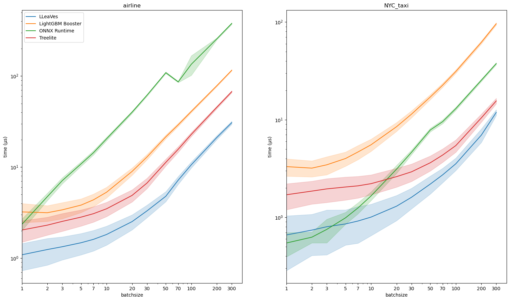
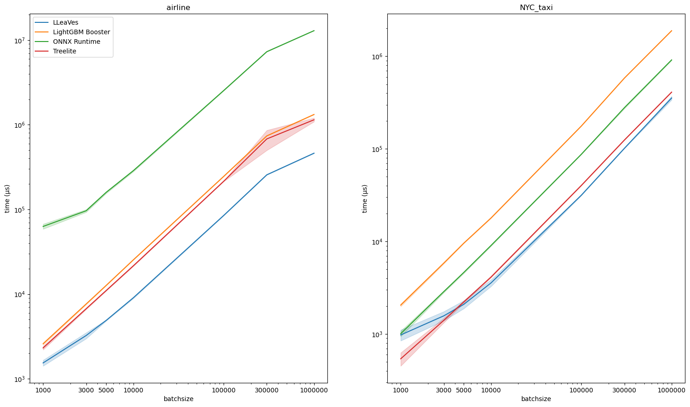

# LLeaves 🐉
A LLVM-based compiler for LightGBM decision trees.

Ingests `model.txt` files from trained LightGBM Models and
converts them into optimized machine code.

## Why LLeaves?
- Drop-in replacement for LightGBM: The interface is a subset of `LightGBM.Booster`.
- Speed: Up to 10x performance increase compared to LightGBM.
- Just two dependencies: `llvmlite` and `numpy`. LLVM comes statically linked.
 
## Why not LLeaves?
Some LightGBM features are not yet implemented in LLeaVes:
- Multiclass prediction
- Linear Models

## Benchmarks
[benchmark script](benchmarks/benchmark.py).
Intel Xeon Haswell, 8vCPUs.
Some of the variance is due to performance interference.

Datasets used:
- NYC-taxi: Focus on numerical features
- Airlines: Focus on categorical features, some with high cardinality (>100)

#### Small batches (single-threaded)

#### Large batches (multi-threaded)


## Development
```bash
conda env create
conda activate lleaves
pip install -e .
pre-commit install
pytest
```

### Tasks
- Come up with a better name (has to be available on PyPI and conda): Waldmeister, treezero, lltc (low level tree compiler)
- Experiment with more efficient bitvector storage for categoricals (Int64 instead of Int32).
- Implement final output transformation function in IR instead of numpy ufunc.
- Add optional single-precision mode
- Parse `internal_count` from model.txt, use it for compiler branch prediction hints. 
  (Caveat: Treelite has branch prediction hints and it doesn't help with speed at all)
- Introduce Cython runtime module? Faster output functions, lower latency multithreading. More effort for packaging.
