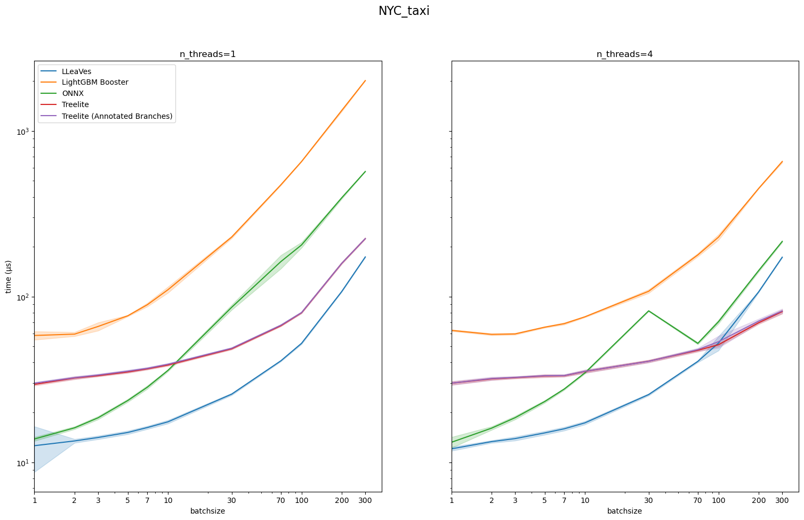
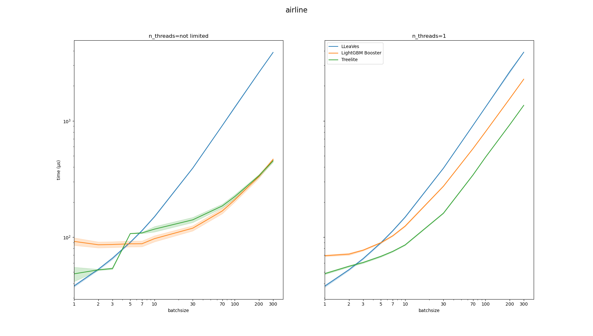

# LLeaves 🐉
A LLVM-based compiler for LightGBM decision trees.

Ingests `model.txt` files from trained LightGBM Models and
converts them into optimized machine code.

## Why LLeaves?
- Easy of use: The interface of `lleaves.Model` is a subset of `LightGBM.Booster`.
- Speed: Up to 10x performance increase compared to LightGBM.
- Few dependencies: `llvmlite` and `numpy`. No C/C++ compiler necessary, LLVM comes statically linked.
  
## Why not LLeaVes?
Some LightGBM features are not yet implemented in LLeaVes:
- Multiclass prediction
- Multithreading
- Linear Models

## Benchmarks
[benchmark script](benchmarks/simple_timeit.py).
LLeaVes has no support for MT so far and is running single-threaded mode only.
#### NYC-taxi
Numerical features only

#### Airlines dataset
Predominantly categorical features with high cardinality


## Development
```bash
conda env create
conda activate lleaves
pre-commit install
pytest
```

### Tasks
- Implement final output transformation function in IR instead of numpy ufunc
- Experiment with more efficient bitvector storage for categoricals
- Refactor `nodes.py` to split AST-traversal from IR Codegen
- Switch to single-precision floats instead of float64.
- Parse node weights from model.txt, use them for compiler branch prediction hints
