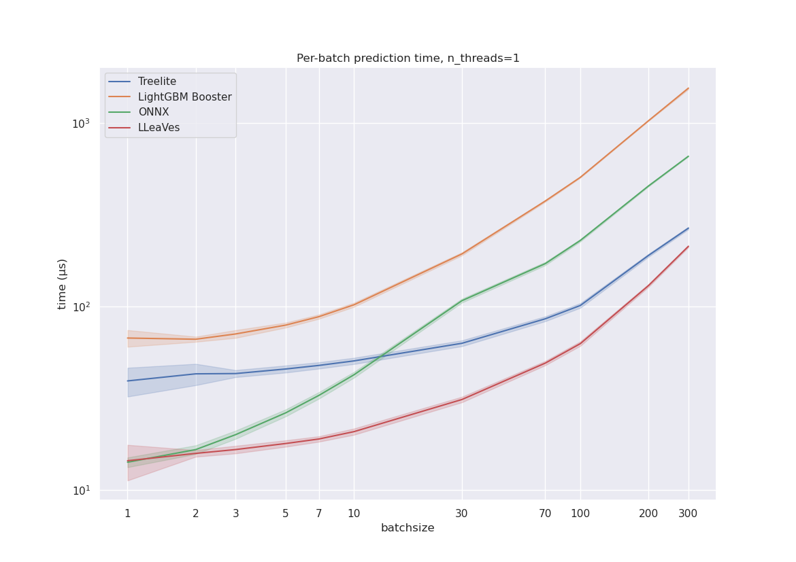
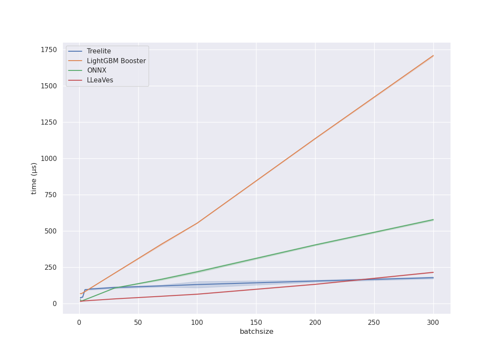

# LLeaVes 🐉
A LLVM-based compiler for LightGBM decision trees.

Ingests `model.txt` files from trained LightGBM Models and
converts them into optimized machine code.

## Why LLeaVes?
- Easy of use: The interface of `lleaves.Model` is a subset of `LightGBM.Booster`.
- Speed: 10x performance increase compared to LightGBM.
- Few dependencies: `llvmlite` and `numpy`. No C/C++ compiler necessary.
  
## Why not LLeaVes?
Some LightGBM features are not yet implemented in LLeaVes:
- Multiclass prediction
- Multithreading
- Linear Models

Some painpoints I'm still ironing out:
- Compilation time for very large categorical models is too long, but should be fixable

## Benchmarks
[benchmark script](benchmarks/simple_timeit.py).
#### Single-threaded prediction on NYC-taxi

#### Multi-threaded prediction on NYC-taxi 
(Note: LLeaVes has no support for MT so far and is running single-threaded mode)


## Development
```bash
conda env create
conda activate lleaves
pre-commit install
pytest
```
