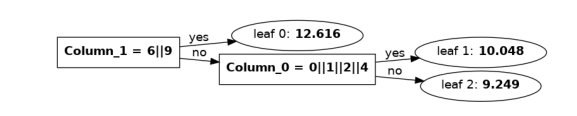

Development documentation
==============================

The only correct behaviour is for ``lleaves`` to behave exactly like LightGBM.
The best way to figure out LightGBM's behaviour is to run and read their code.

LightGBM's model serialization
------------------------------

The serialization format isn't documented.
The information here was compiled by reading through LightGBM's codebase.

Decision Types
*********************

The encoding of the decision types is fairly straightforward and determined by masks.
Three things are encoded:

1. Categorical vs Numerical node.
2. Default left: This determines which direction (left or right) is taken when the missing type is encountered.
3. Missing type: ``NaN``, ``None`` or ``Zero``.

Branch prediction
*****************
The ``internal_count`` variable stores for each node of the tree, how many datapoints of the dataset pass through it.
For the root node this is equal to ``len(dataset)``.
The respective information for tree leaves is saved in ``leaf_count``.

This could be used to add branch prediction hints to the LLVM compiler.

Missing Values
***************

For dealing with missing values it's best to look at the LightGBM code.
Example: If the missing type is *None* and a ``NaN`` is encountered, the ``NaN`` gets mapped to ``0.0``.
This means for this node ``NaN`` will behave like ``0.0``, irrespective of the value of *default left*.
In lleaves all combinations of decision type, default left and missing type are tested against LightGBM.

Categorical features
*********************

In LightGBM, categoricals are represented as non-negative integers smaller than `2^31-1`.
A tree with categoricals looks like this in the *model.txt*::

    Tree=0
    num_leaves=3
    num_cat=2
    split_feature=1 0
    split_gain=88471.5 4720.24
    threshold=0 1
    decision_type=1 1
    left_child=-1 -2
    right_child=1 -3
    leaf_value=12.616231057968633 10.048276920678525 9.2489478721549396
    leaf_weight=106 120 274
    leaf_count=106 120 274
    internal_value=10.182 9.48306
    internal_weight=0 394
    internal_count=500 394
    cat_boundaries=0 1 2
    cat_threshold=576 23
    is_linear=0
    shrinkage=1

To make comparing against many categoricals faster, LightGBM uses vectors of bits which are stored in as
32-bit integers in ``cat_threshold``.
Looking at the root node's threshold: `576 = 2^6 + 2^9`.
Therefore categories 6 and 9 go left, all others go right.
The alternative would be to implement this as two nodes with a `X==6?` and a `X==9?` condition, which is how ONNX does it.

When the largest category appearing in a node is bigger than 32 we need more integers to store the bits.
This is specified by the ``cat_boundaries``.
For a categorical node its ``threshold`` is the index into the ``cat_boundaries``-array.
The number of i32 bitvectors for a categorical node is given by ``cat_boundaries[threshold+1]-cat_boundaries[threshold]``.

An example from the *model.txt* of the airlines model::

    cat_boundaries=0 1 2 10 19 27 36 45 54 63 70 79 84 93 94 102 110 118 126 135 136 142 151 160 165

The bitvectors of the first three categorical nodes are <1 x i32>, <1 x i32> and <8 x i32> long.

Multiclass prediction
*********************

Multiclass prediction works by basically fitting individual forests for each class, and then running a
softmax across the outputs.
So for 3 classes with 100 iterations LightGBM will generate 300 trees.
The trees are saved in the model.txt in strides, like so::

    tree 0 # (=class 0, tree 0)
    tree 1 # (=class 1, tree 0)
    tree 2 # (=class 2, tree 0)
    tree 3 # (=class 0, tree 1)
    tree 4 # (=class 1, tree 1)
    ...

Software Architecture Overview
------------------------------

1. ``lleaves.py``: Provides the main class (`Model`) with the predict interface. Also handles
   the `engine` (LLVM execution environment) in a centralized way. The final compile step (LLVM IR
   ⇒ ASM) is performed here.
2. ``compiler``: this model ingests a `model.txt` and returns the optimized LLVM IR module

   1. ``ast``: Scans the `model.txt`, parses the content to an abstract-syntax tree.
   2. ``codegen``: Takes the AST, optimizes it and emits LLVM IR.
   3. ``tree_compiler.py``: Calls the other modules, runs compiler optimization passes.

LLVM IR Generation
-------------------

To look at the IR generated by ``lleaves`` there are two useful environment variables:

- Set ``LLEAVES_PRINT_UNOPTIMIZED_IR=1`` to look at the LLVM IR generated by ``lleaves`` before any LLVM compiler
  optimization passes are run.
- Set ``LLEAVES_PRINT_OPTIMIZED_IR=1`` to look at the final LLVM IR after the LLVM compiler optimization passes.
- Set ``LLEAVES_PRINT_ASM=1`` to look at the assembly code produced by the compiler.

